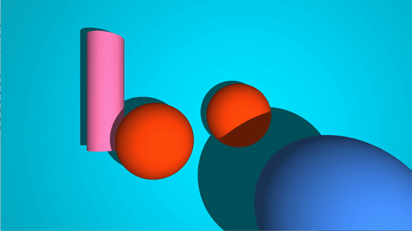

# MiniRT

miniRT is a simple ray tracing program designed to model images following the ray tracing protocol. The images produced represent scenes viewed from a defined angle and contain simple geometric objects, each with its own lighting system.

  <h2>Requirements</h2>
  <ul>
    <li>macOS</li>
    <li>glfw</li>
    <li>Cmake</li>
  </ul>

  <h2>Features</h2>
  <ul>
    <li>Rendering of simple geometric objects: plane, sphere, and cylinder.</li>
    <li>Proper handling of window management ensuring smooth transitions between windows and resolution changes.</li>
    <li>Capability to modify the size of unique properties of objects, such as diameter for a sphere, and height and length for a cylinder.</li>
    <li>Implementation of transformations for objects, lights, and camera: translation and rotation (excluding spheres and lights which cannot be rotated).</li>
    <li>Lighting effects including brightness, shadows, and ambient light.</li>
    <li>Display of images in a window with user-friendly interaction:
      <ul>
        <li>Pressing the ESC key closes the window and exits the program.</li>
        <li>Clicking the close button on the window closes the window and exits the program.</li>
      </ul>
    </li>
  </ul>

  <h2>Usage</h2>
  
Compile the program using the provided Makefile with the following commands:

  <code>make</code>
  
Execute the program with a scene description file as the first argument:

  <code>./miniRT scene.rt</code>

  <h2>Scene Description Format</h2>
  
For detailed information on each element type and its format, refer to the provided scene description examples.

  <h2>Error Handling</h2>
  
If any configuration issues are encountered in the scene file, the program will exit with an error message indicating the problem.

  <h2>Example</h2>
  
Here's a minimal example of a .rt scene file:

  <pre>
A 0.2 255,255,255
C -50,0,20 0,0,1 70
L -40,0,30 0.7 255,255,255
pl 0,0,0 0,1,0 255,0,225
sp 0,0,20 20 255,0,0
cy 50,0,20.6 0,0,1 14.2 21.42 10,0,255
  </pre>

  <h2>Notes</h2>
  
You can go around the scene using WASD or arrows

## Demo

